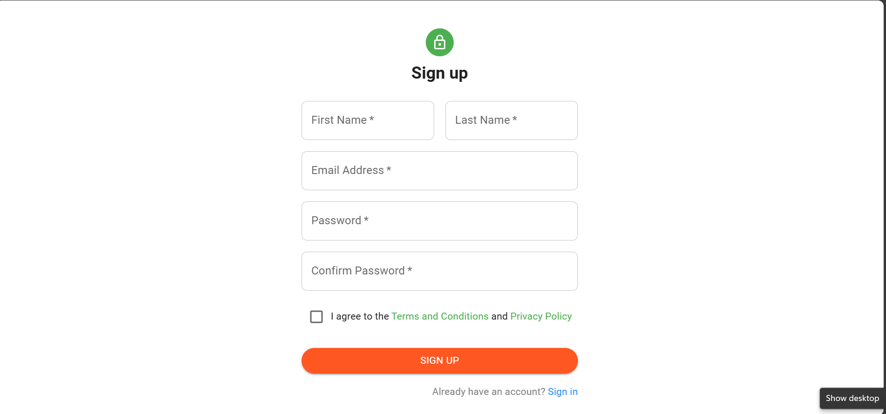
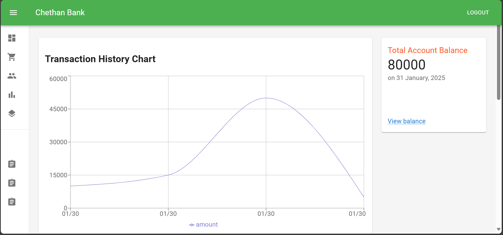
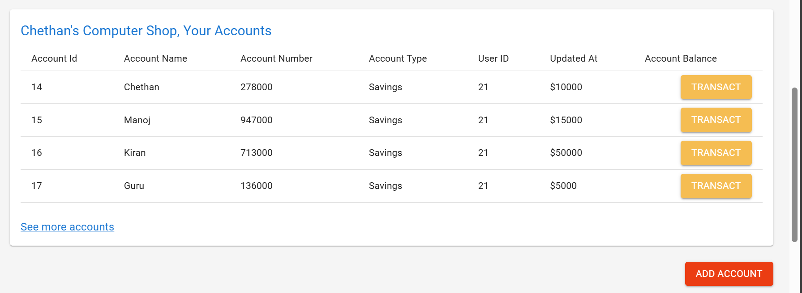
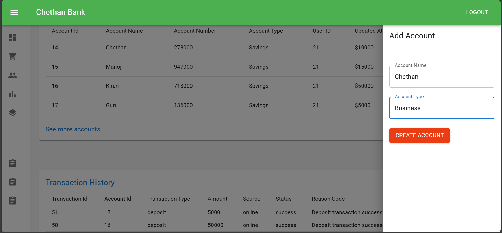
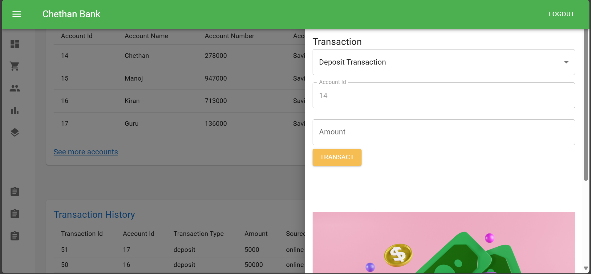
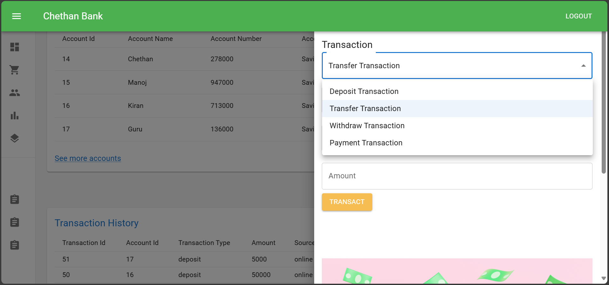
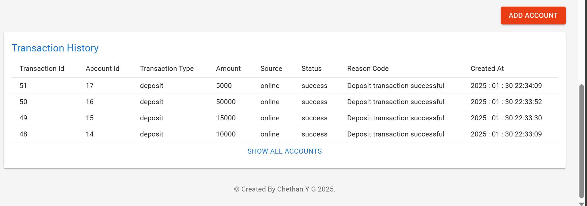

# **Banking System - Spring Boot & React**

A full-fledged banking system built with **Spring Boot, Hibernate, React, Redux, and Material UI**. This application provides **JWT-based authentication and authorization**, along with core banking functionalities such as account management, transactions, payments, and transaction history.

---

## 📌 **Features**

### 🔐 Authentication & Authorization
- User **Login** & **Registration** with JWT-based security.

### 📊 Dashboard
- **Graphical Analysis** of transactions.
- Overview of **all accounts** with balances.

### 🏦 Account Management
- View **multiple accounts**.
- Add new **bank accounts**.

### 💰 Transactions
- **Deposit**, **Withdraw**, and **Transfer** funds between accounts.
- Make **payments** to other users.

### 📜 Transaction History
- View **detailed transaction history**.

---

## 🛠 **Tech Stack**

### **Backend**
- 🟢 **Spring Boot** (Java)
- 🔐 **Spring Security & JWT** (Authentication & Authorization)
- 🗄 **Hibernate & JPA** (Database ORM)
- 🏦 **MySQL** (Database)

### **Frontend**
- ⚛ **React** & **Redux**
- 🎨 **Material UI** (Modern UI Components)
- 🌐 **Axios** (API requests)

---

## 📂 **Project Structure**

```bash
Banking-System-SpringBoot-React-Redux/
│── Bank-Backend/         # Spring Boot backend
│── Bank-Frontend/        # React frontend
│── README.md             # Project documentation
```

---

## 🖼 **Screenshots**

| Feature | Screenshot |
|---------|------------|
| *Login Page* |  |
| *Register Page* |  |
| *Dashboard* |  |
| *Accounts* |  |
| *Add Account* |  |
| *Deposit* |  |
| *Transfer* |  |
| *Transaction History* |  |


---

## 🚀 **Installation**

### **Backend (Spring Boot)**
1. Navigate to the backend folder:
   ```sh
   cd bank-backend
   ```
2. Configure `application.properties` with your database credentials.
3. Build and run:
   ```sh
   mvn clean install
   mvn spring-boot:run
   ```

### **Frontend (React)**
1. Navigate to the frontend folder:
   ```sh
   cd bank-frontend
   ```
2. Install dependencies:
   ```sh
   npm install
   ```
3. Start the development server:
   ```sh
   npm start
   ```

---

## 🤝 **Contributing**

Feel free to open a **pull request** or **issue** if you would like to contribute to this project.

---


🚀 **Happy Coding!**

